# 🛡️ Infrastructure Hardening & Plateforme de Prévention (Project: Brocoli)

> ⚠️ **DISCLAIMER :** Cette infrastructure (dontbesad.tech) n'est plus active. Les adresses IP, clés API et configurations exposées sont obsolètes. Ce dépôt est une archive technique documentant 3 mois de montée en compétence intensive en Cybersécurité et Admin Système.

---

### 🌐 1. Le Projet : "DontBeSad.tech"
Au-delà de la technique, ce projet hébergeait une plateforme de prévention contre la tristesse. 
- **Mission :** Offrir un espace de soutien via une interface web propre.
- **Innovation AI :** Intégration d'un **Chatbot intelligent** (API OpenAI) capable de répondre aux utilisateurs en temps réel.
- **Stack Web :** Frontend `chat.html` couplé à un `backend.php` pour la gestion des requêtes API.
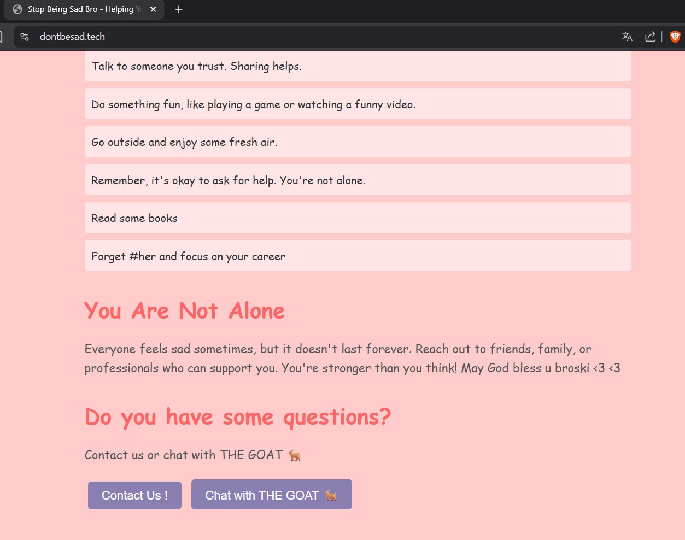
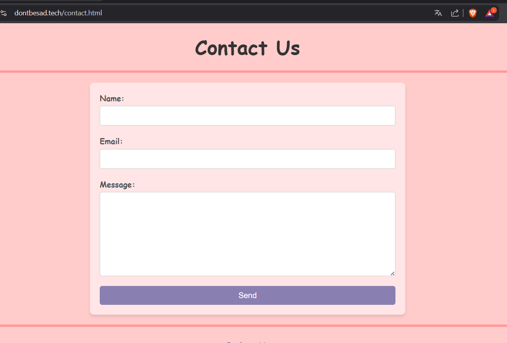
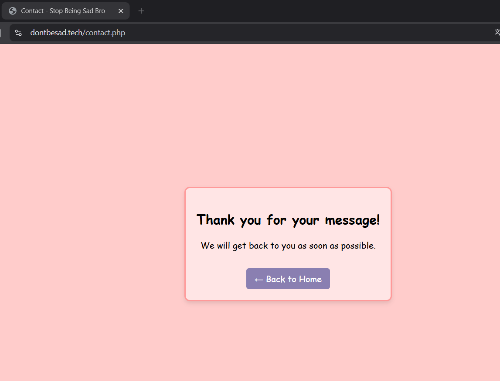
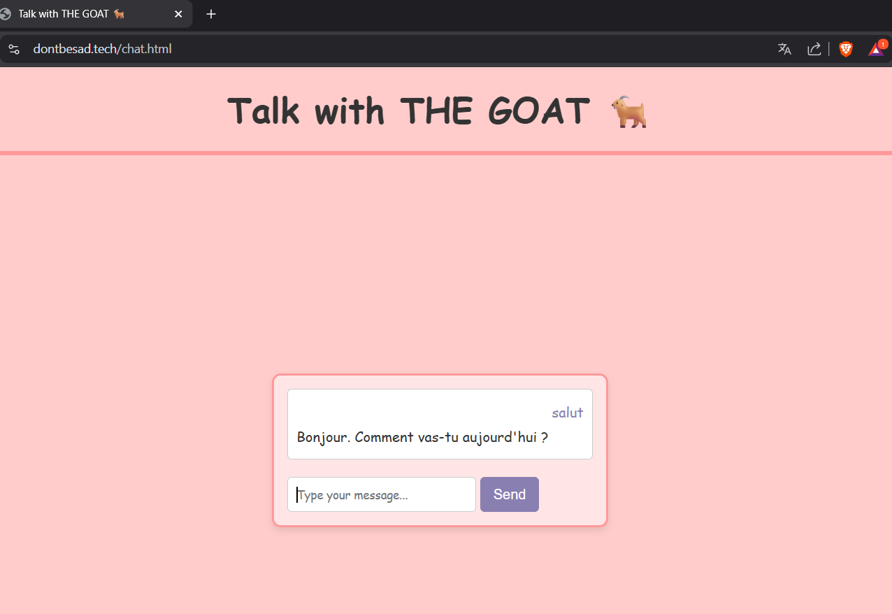

### 🔓 2. Hardening SSH & Accès Périmétrique
Sécurisation de la porte d'entrée principale pour bloquer 99% des scans automatisés.
- **Mutation :** Port SSH déplacé du `22` au `1949`.
- **Politique Zero Trust :** Désactivation du compte `root`, accès exclusif via clés SSH (Ed25519/RSA).
- **Config :** Hardening via `/etc/ssh/sshd_config.d/50-cloud-init.conf`.

### 🧱 3. Firewalling Stricte (UFW) & Réseau
- **Whitelist IP :** Seule mon IP personnelle est autorisée à solliciter le port SSH.
- **IPv6 Hardening :** Désactivation totale de la pile IPv6 pour réduire la surface d'attaque.
- **Status :** Contrôle permanent via `sudo ufw status verbose`.
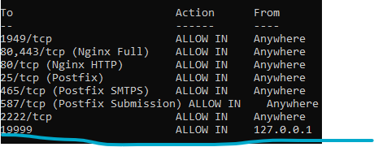

### ⛓️ 4. IPS & Monitoring des Menaces (Fail2Ban)
Mise en place de "prisons" dynamiques pour un bannissement automatique des IPs malveillantes.
- **Jails Custom :** `sshd` (port 1949), `sshd-preauth` (détection fine via regex) et `cowrie` (Honeypot).
- **Ban Auto :** Configuration de `bantime` à 3600s et jusqu'à 24h pour les attaques sur le Honeypot.
- **Commandes :** Utilisation intensive de `fail2ban-client status`.
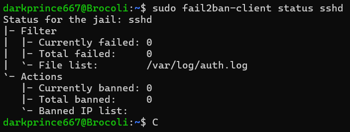
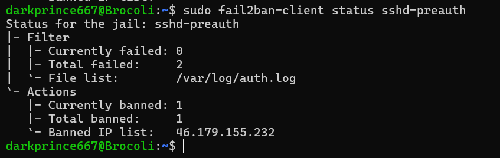
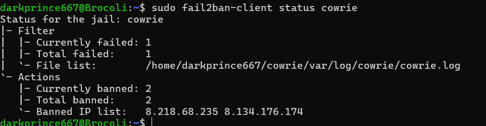
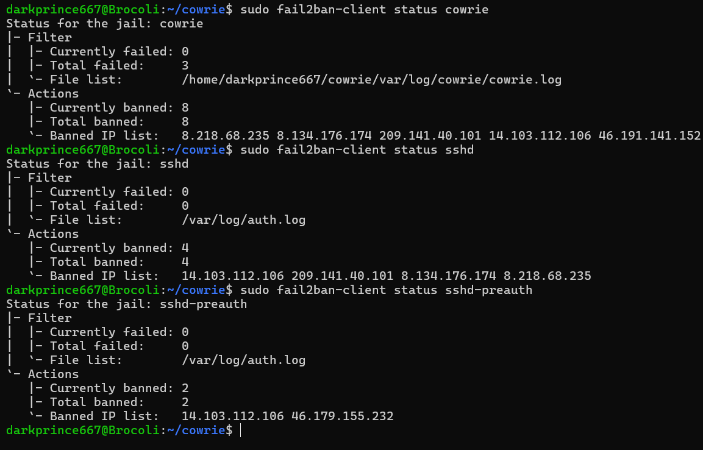

### 🍯 5. Threat Intelligence : Cowrie Honeypot
Observation active des attaquants via un leurre sophistiqué.
- **Leurre :** Simulation d'un serveur vulnérable sur le port `2222` (vu comme le 22 par l'attaquant).
- **Collecte :** Analyse des tentatives de login via `userdb.txt` et monitoring des logs via `bin/cowrie start`.
- **Analyse :** Script Python `analyse_logs.py` pour cartographier les attaquants.
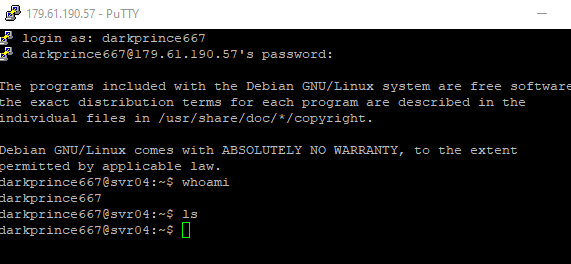
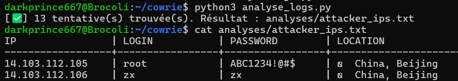
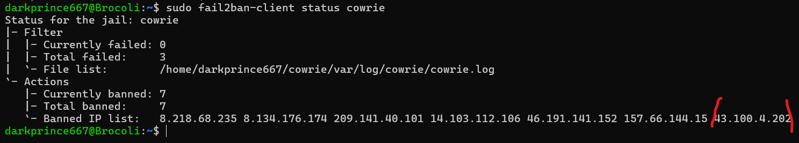

### 📧 6. Infrastructure Mail Souveraine (Mailcow & Postfix)
Déploiement d'une stack mail complète et sécurisée sous Docker.
- **Délivrabilité :** Configuration DKIM, SPF et signatures via `opendkim` pour éviter les spams.
- **Docker :** Utilisation de `docker-compose` pour orchestrer Mailcow (Postfix, Dovecot, SOGo).
- **Sécurité :** Reverse proxy Nginx avec certificats SSL et filtrage Rspamd.

### 📊 7. Monitoring & Stealth Management (Netdata)
Surveillance des performances sans exposition publique.
- **Metrics :** Monitoring CPU/RAM/IO via Netdata (port 19999).
- **Accès Sécurisé :** Port fermé sur le Firewall, accès uniquement via un **Tunnel SSH local** : `ssh -p 1949 -L 19999:localhost:19999`.

### 🧪 8. Deception supplémentaire & Lab
- **Socat :** Simulation de faux services (port 25565) avec messages de "troll" pour les scanners de ports.
- **Docker :** Gestion des conteneurs et des images via `docker ps`.

---

### ⚡ Bilan & Expérience
Ce projet est le résultat de **3 mois** de travail acharné. L'objectif n'était pas seulement de monter un serveur, mais de créer un écosystème complet, sécurisé et utile. 
- **Gain d'expérience :** Hardening Linux, administration Docker, gestion DNS/SSL, analyse de logs de sécurité et intégration d'IA.
- **Finalité :** Apprendre à défendre une infrastructure en comprenant comment elle est attaquée.
