# 🛡️ Infrastructure Hardening & Plateforme de Prévention (Project: Brocoli)

> ⚠️ **DISCLAIMER :** Cette infrastructure (dontbesad.tech) n'est plus active. Les adresses IP, clés API et configurations exposées sont obsolètes. Ce dépôt est une archive technique documentant 3 mois de montée en compétence intensive en Cybersécurité et Admin Système.

---

### 🌐 1. Le Projet : "DontBeSad.tech"
Au-delà de la technique, ce projet hébergeait une plateforme de prévention contre la tristesse. 
- **Mission :** Offrir un espace de soutien via une interface web propre et interactive.
- **Innovation AI :** Intégration d'un **Chatbot intelligent** (API OpenAI) configuré pour répondre aux utilisateurs en temps réel (investissement de 5€ pour le bien commun).
- **Stack Web :** Frontend `chat.html` couplé à un `backend.php` pour la communication API.

### 🔓 2. Hardening SSH & Accès Périmétrique
Sécurisation de la porte d'entrée principale pour neutraliser les vecteurs d'attaque classiques.
- **Obscurité active :** Migration du port SSH du `22` au `1949`.
- **IAM :** Suppression du compte `root`, création d'un utilisateur privilégié et authentification par clés SSH (Ed25519) uniquement.
- **Hardening :** Configuration via `sudo nano /etc/ssh/sshd_config.d/50-cloud-init.conf`.

### 🧱 3. Firewalling Stricte (UFW) & Réseau
- **Whitelist IP :** Seule mon IP personnelle est autorisée à solliciter le port SSH `1949`.
- **IPv6 Hardening :** Désactivation complète de l'IPv6 (`/etc/default/ufw`) pour limiter les vecteurs de fuite.
- **Monitoring :** Contrôle via `sudo ufw status verbose`.

### ⛓️ 4. IPS & Monitoring des Menaces (Fail2Ban)
Mise en place de "prisons" dynamiques avec bannissement automatique.
- **Jails Custom :** `sshd` (port 1949), `sshd-preauth` (regex pour intercepter les pre-auth failures) et `cowrie` (Honeypot).
- **Hardening temporel :** `findtime = 600`, `bantime = 3600` (ou 24h pour le honeypot).
- **Gestion manuelle :** Bannissement manuel via `fail2ban-client set [jail] banip [IP]`.

### 🍯 5. Threat Intelligence : Cowrie Honeypot
Observation et analyse des payloads et comportements des attaquants.
- **Leurre :** Simulation d'un shell vulnérable sur le port `2222`.
- **Configuration :** Gestion des bannières custom dans `banner.txt` et base de credentials factices dans `userdb.txt`.
- **Analyse :** Script Python `analyse_logs.py` pour générer des rapports sur les tentatives de login.

### 📧 6. Infrastructure Mail : Mutt & Mailcow
Gestion des flux mail, de la CLI vers l'automatisation.
- **Mutt (CLI) :** Utilisation principale de `Mutt` pour l'envoi de logs et de fichiers (photos) directement depuis le serveur. Configuration du `.muttrc` pour la gestion des alias.
- **Postfix & DKIM :** Configuration de `opendkim` pour la signature des messages et la délivrabilité.
- **Mailcow (Docker) :** Déploiement d'une instance Mailcow via `docker-compose` en fin de projet pour centraliser l'interface et le reverse proxy SSL, servant de base à une automatisation plus "pro".
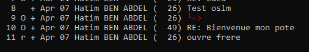
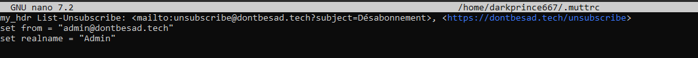
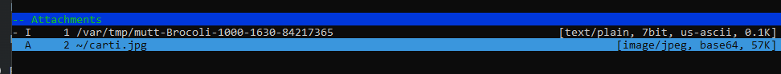
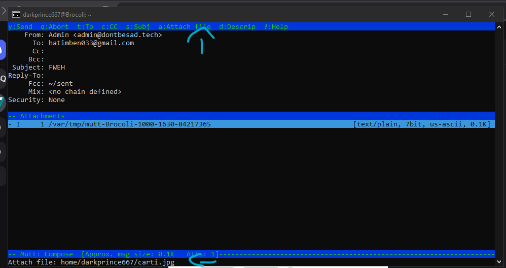
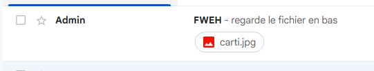
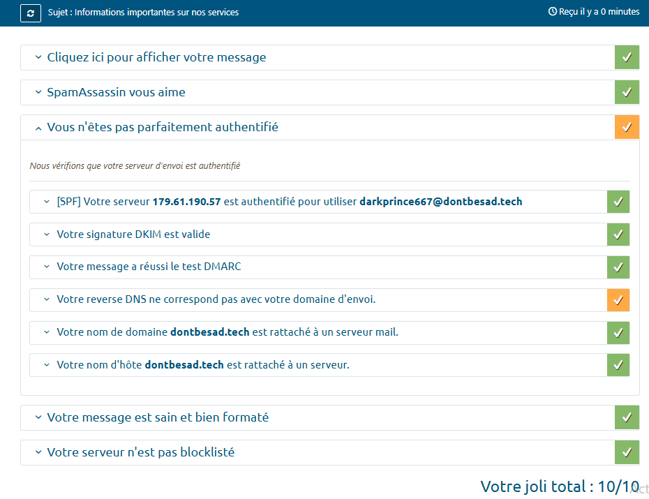
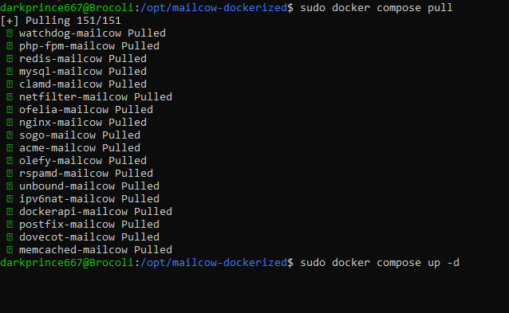

### 📊 7. Monitoring & Stealth Management (Netdata)
- **Metrics :** Surveillance en temps réel via Netdata (port 19999).
- **Accès Sécurisé :** Port fermé sur le Firewall. Accès uniquement via **Tunnel SSH local** : `ssh -p 1949 -L 19999:localhost:19999 [user]@[IP]`.
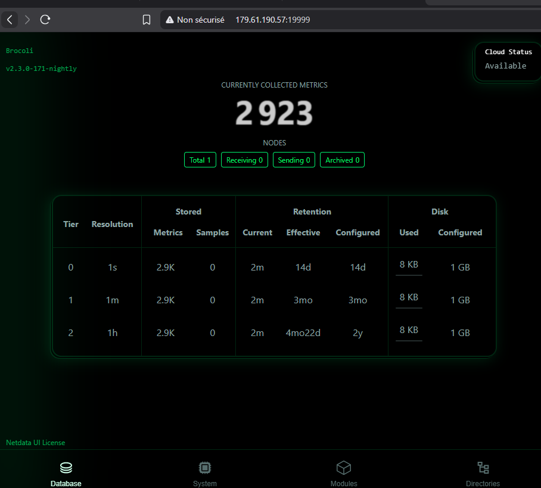
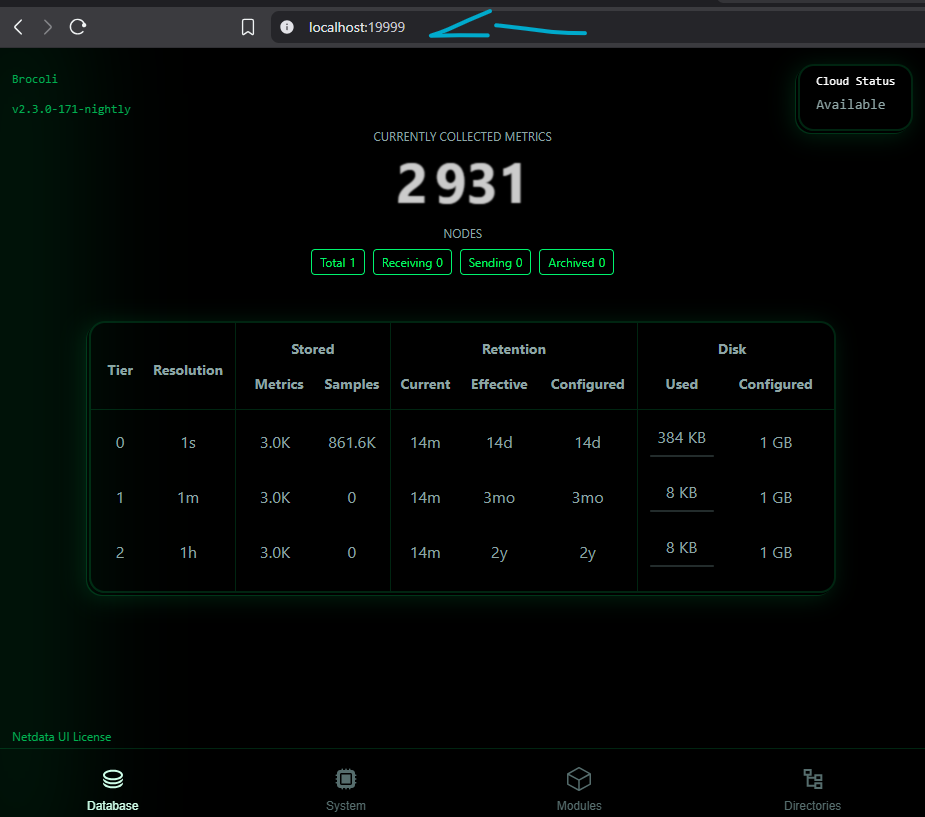
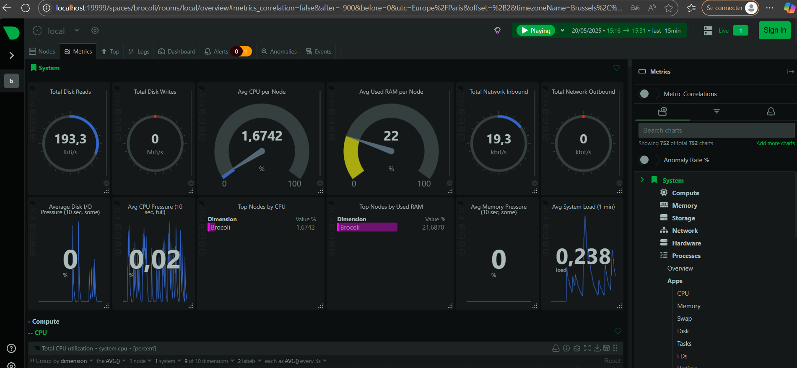

### 🧪 8. Deception supplémentaire & Lab
- **Socat :** Simulation de faux services (port 25565) avec message de dérision pour les scanners : `"§cC'est un faux serveur mdr t genant"`.
- **Docker :** Orchestration des services via `docker-compose` et isolation des environnements.
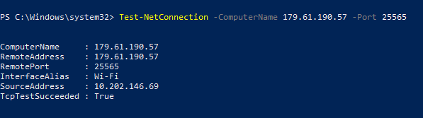

---

### ⚡ Bilan & Expérience
Ce projet est le résultat de **3 mois** de travail acharné. L'objectif était de construire un écosystème complet, utile et sécurisé.
- **Gain d'expérience :** Hardening Linux, administration Docker, gestion DNS/SSL, analyse de logs de sécurité et intégration d'IA.
- **Conclusion :** Apprendre la défense en profondeur en observant directement les méthodes d'attaque réelles.
